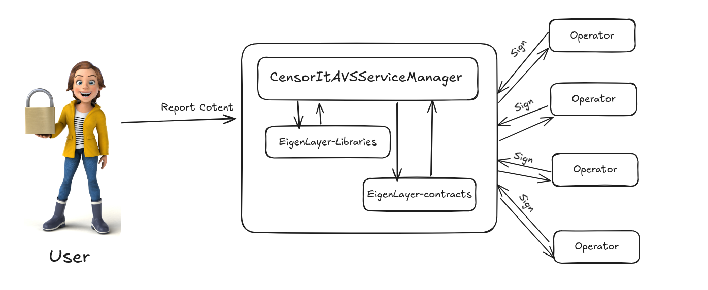

# CensorIt

CensorIt is a Content Moderation system built on the Eigenlayer AVS and deployed using AltLayer Wizard on Holesky Testnet. The system allows users to submit content for moderation, specifying violation types, which are then verified by designated operators.

To see the CLI interface [Visit Here]("https://github.com/CensorIt/CensorIt-CLI)



## Purpose

The goal of this project is to enhance content moderation using a decentralized approach, ensuring security and reliability through the Eigenlayer AVS system.

## Features

- **Decentralized Content Submission**: Users can submit any kind of data through a CLI or an IPFS URL.
- **Violation Reporting**: Users specify the type of violation, which is then verified by operators.
- **Secure Verification Process**: Utilizing the Eigenlayer AVS system to ensure secure handling of submissions.

## Technology Stack

- **Language**: Solidity
- **Framework**: Foundry
- **Deployed On**: AltLayer Wizard

## Getting Started

To set up the project locally, follow these steps:

### Prerequisites

Make sure you have the following installed:

- Node.js
- Foundry
- A compatible environment (WSL, Linux, or macOS)

### Installation

1. Clone the repository:
```bash
   git clone https://github.com/CensorIt/AVS-contracts
   cd AVS-contracts  
```
2. Build the project:
```bash
   forge build
```  

3. Run Tests:
```bash
    forge test
```

## Usage
Users can submit content and report violations via the command line interface. 

## Contributors

This project is developed by SkyDevs at AVSThon Hackathon by EigenLayer and AltLayer 